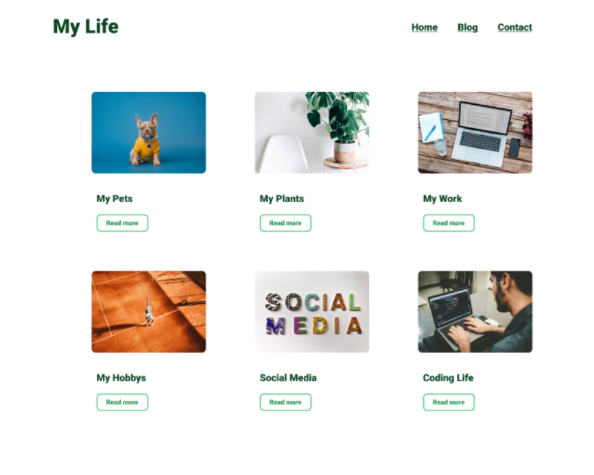

# Aufgabenstellung

Heute wollen wir eine simple Blog Website erstellen. 

Assets
Link zum Design:
https://www.figma.com/file/SIDeooqeR4KnakAOrDjEw9/Simple-Blog?node-id=0%3A1

### Hinweis
https://reactrouter.com/docs/en/v6/getting-started/installation
Nutze react-router-dom, um ein Routing zu erstellen.
Das Array mit den Daten befindet sich im Kommentarbereich.

### Ergebnisvorschau

## Mein Ergebnis

